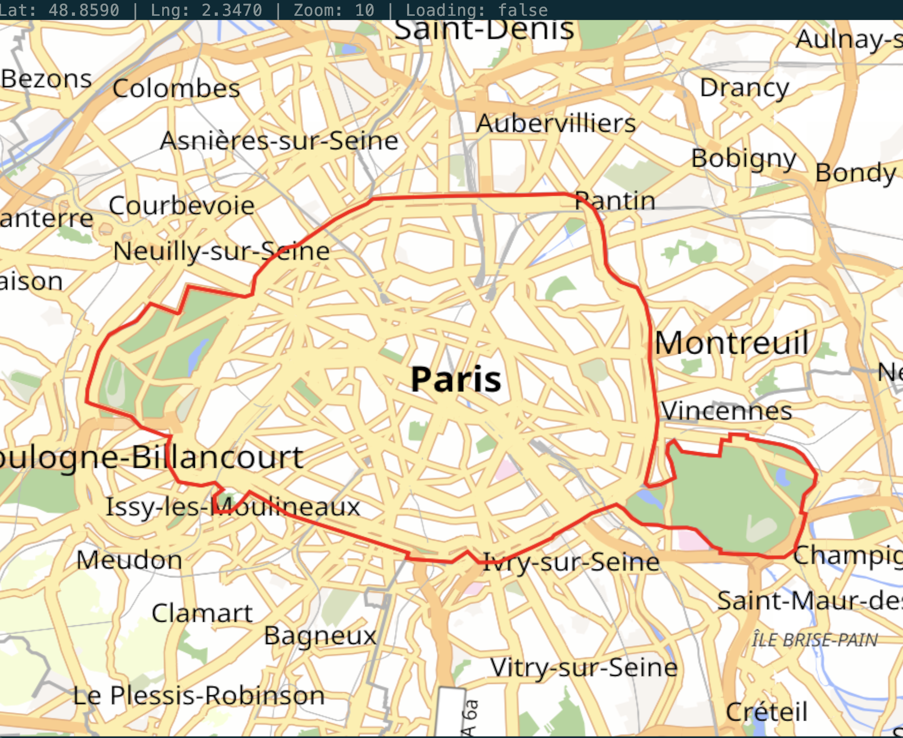

# tiletea


A [Bubble Tea](https://github.com/charmbracelet/bubbletea) (v2) component that
renders an interactive slippy map in the terminal using the
[Kitty graphics protocol](https://sw.kovidgoyal.net/kitty/graphics-protocol/).



It's a thin, embeddable wrapper around
[`github.com/akhenakh/maprender`](https://github.com/akhenakh/maprender), which
fetches Mapbox Vector Tiles and rasterises them according to a Mapbox GL Style.

## Requirements

- A terminal that supports the Kitty graphics protocol, e.g.
  [Kitty](https://sw.kovidgoyal.net/kitty/), [WezTerm](https://wezfurlong.org/wezterm/),
  [Ghostty](https://ghostty.org/), [foot](https://codeberg.org/dnkl/foot), or iTerm2.
- Go 1.26+.

## Installation

```sh
go get github.com/akhenakh/tiletea
```

> **Important:** see [Ultraviolet version caveat](#ultraviolet-version-caveat)
> before upgrading `charm.land/bubbletea/v2`.

## Quick start

Use the component standalone:

```go
package main

import (
	"fmt"
	"os"

	tea "charm.land/bubbletea/v2"
	"github.com/akhenakh/tiletea"
)

func main() {
	m := tiletea.New(40.7128, -74.0060, 14, // NYC, zoom 14
		tiletea.WithMarker(40.7128, -74.0060),
	)

	p := tea.NewProgram(m)
	if _, err := p.Run(); err != nil {
		fmt.Fprintf(os.Stderr, "error: %v\n", err)
		os.Exit(1)
	}
}
```

Run it:

```sh
go run .
```

A complete example lives in [`cmd/browse`](./cmd/browse), including debug
logging:

```sh
DEBUG=1 go run ./cmd/browse   # writes render logs to debug.log
```

## Embedding in a larger app

`tiletea.Map` implements `tea.Model`, so it can be embedded like any other
component. Return it from your own model's `Init`, `Update`, and `View`:

```go
type app struct {
	m *tiletea.Map
}

func (a app) Init() tea.Cmd           { return a.m.Init() }
func (a app) View() tea.View          { return a.m.View() }

func (a app) Update(msg tea.Msg) (tea.Model, tea.Cmd) {
	m, cmd := a.m.Update(msg)
	a.m = m.(*tiletea.Map)
	return a, cmd
}
```

## Configuration

`New(lat, lng float64, zoom int, opts ...Option)` accepts the following
functional options:

| Option | Description |
| --- | --- |
| `WithMarker(lat, lng)` | Place a marker at the given coordinates. |
| `WithOverlays(overlays...)` | Draw `maprender.Overlay` geometries on top of the map. |
| `WithFitOverlays()` | Center and zoom the map to fit the overlays on first render. |
| `WithStyle(style)` | Supply a pre-fetched `*maprender.MapStyle`, skipping style fetching. |
| `WithStyleURL(url)` | Override the Mapbox GL style URL (default `DefaultStyleURL`). |
| `WithTileSource(url)` | Override the TileJSON endpoint used to resolve the tile URL (default `DefaultSourceURL`). |
| `WithTileURLTemplate(tmpl)` | Supply the `{z}/{x}/{y}` tile URL template directly, bypassing TileJSON. |
| `WithSourceMaxZoom(z)` | Set the source max zoom, used for overzoom when a template is supplied directly. |
| `WithTileCache(dir, ttl)` | Configure the on-disk tile cache (default `~/.cache/maprender`, 2-week expiry). Empty `dir` keeps the default; non-positive `ttl` disables expiry. |
| `WithLogger(l)` | Set the `*slog.Logger` used for render/debug output. |
| `WithAltScreen(bool)` | Enable or disable the alternate screen buffer (enabled by default). |

Useful methods:

- `Center() (lat, lng float64)` and `Zoom() int` read the current view.
- `SetMarker(lat, lng *float64)` sets or clears (nil) the marker.
- `SetOverlays(overlays ...maprender.Overlay)` replaces the drawn overlays.
- `FitOverlays() tea.Cmd` recenters and rezooms to fit the current overlays.

## Geometry view

`GeomView` is a Bubble Tea model that renders geometry on a map fitted to its
bounds. It accepts GeoJSON, WKT, WKB, or a `geom.Geometry`:

```go
package main

import (
	"fmt"
	"os"

	tea "charm.land/bubbletea/v2"
	"github.com/akhenakh/tiletea"
)

func main() {
	gv, err := tiletea.NewGeomViewFromWKT(
		"POLYGON((-74.02 40.70, -74.00 40.70, -74.00 40.72, -74.02 40.72, -74.02 40.70))",
	)
	if err != nil {
		fmt.Fprintln(os.Stderr, err)
		os.Exit(1)
	}

	p := tea.NewProgram(gv)
	if _, err := p.Run(); err != nil {
		fmt.Fprintf(os.Stderr, "error: %v\n", err)
		os.Exit(1)
	}
}
```

Constructors: `NewGeomViewFromGeoJSON([]byte)`, `NewGeomViewFromWKT(string)`,
`NewGeomViewFromWKB([]byte)`, `NewGeomViewFromGeometry(geom.Geometry)`, and the
lower-level `NewGeomView([]maprender.Overlay, ...)`.

Overlay colors default to a red stroke with no fill, overridable via
`maprender.Overlay{StrokeColor, FillColor}` or GeoJSON feature properties
(`stroke`/`fill` keys). A runnable example lives in
[`cmd/geom`](./cmd/geom):

```sh
go run ./cmd/geom -geojson feature.geojson
go run ./cmd/geom -wkt "LINESTRING(-74.02 40.70, -74.00 40.72)"
```

## Controls

| Keys / Mouse | Action |
| --- | --- |
| Arrow keys / `h` `j` `k` `l` | Pan |
| `+` / `=` | Zoom in |
| `-` | Zoom out |
| Mouse wheel up/down | Zoom in/out |
| `q` / `ctrl+c` | Quit |

## Ultraviolet version caveat

This component renders the map by embedding raw Kitty graphics APC escape
sequences (`ESC _ G ... ESC \`) into the Bubble Tea view string.

Starting with `charm.land/bubbletea/v2 v2.0.8` (which pulls in
`github.com/charmbracelet/ultraviolet` ≥ `v0.0.0-20260703014108`), the
renderer skips zero-width cells, and those APC sequences are silently dropped
from the terminal output — so the map no longer appears.

Pin Bubble Tea to the newest version that still works:

```sh
go get charm.land/bubbletea/v2@v2.0.7
```

That resolves `ultraviolet` to `v0.0.0-20260525132238` and
`github.com/charmbracelet/x/ansi` to `v0.11.7`, both of which preserve the
Kitty graphics sequences.
